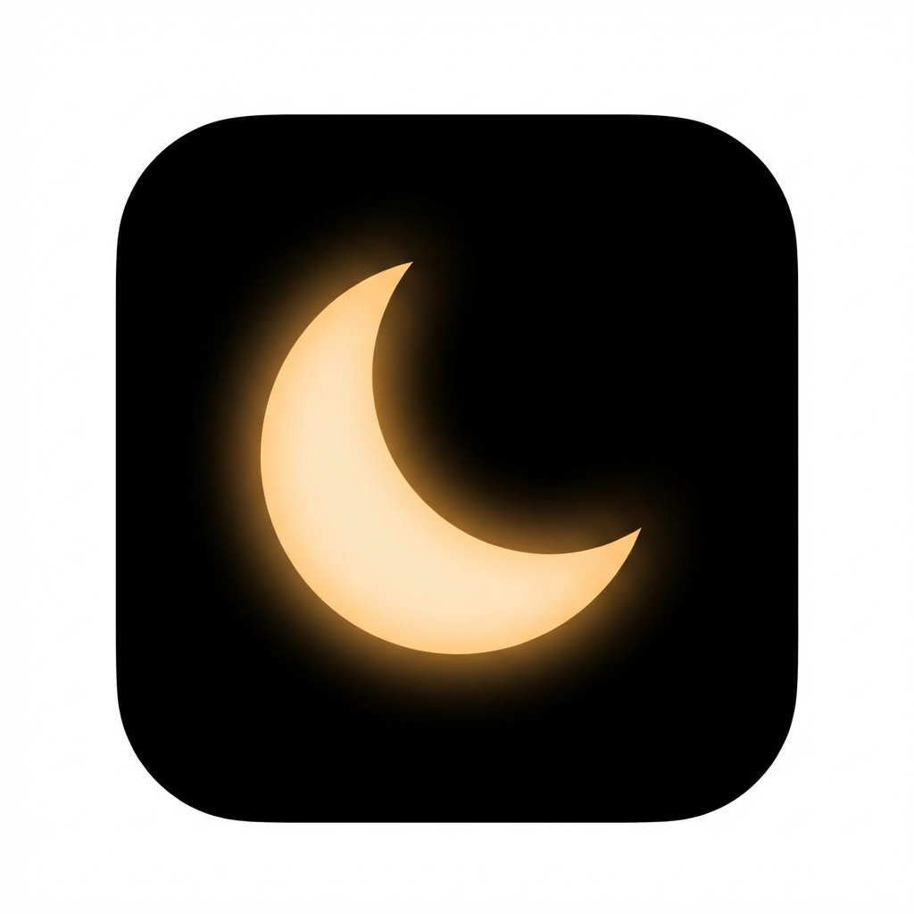

# 🌙 SAT: Sleep Anxiety Tracker

> *Break the 2 AM anxiety loop. A gentle companion for sleepless nights.*

<p align="center">
  
</p>

<p align="center">
  <a href="https://kutral.github.io/sleep/"><strong>Launch App</strong></a> · 
  <a href="#-features">Features</a> · 
  <a href="#-the-science">The Science</a> · 
  <a href="#-installation">Install</a>
</p>

---

## 🌌 What is SAT?

SAT (Sleep Anxiety Tracker) is **not** a sleep tracker. It is **not** a meditation app. It is a **Panic Interrupter**.

Designed specifically for the moment you wake up at 2 AM with a racing heart, SAT uses cognitive science to hijack your brain's "fight or flight" response and gently steer it back to safety.

**Offline-Ready. Privacy-First. Zero Tracking.**

---

## ✨ Features

### 🔥 The Worry Burner
Externalize your anxiety. Type out the thought that is haunting you, and watch it visually burn away into digital ash particles using our custom particle engine. A powerful psychological release mechanism.

### 🔊 Generative Soundscapes
Bypass silence with our advanced Web Audio API engine. Unlike recorded loops, these sounds are generated in real-time:
*   **Brown Noise:** Deep, rumble-frequency noise to mask thoughts.
*   **Heavy Rain:** Pink noise-based generative rain.
*   **Crackling Fire:** Warm, erratic popping sounds.
*   **Thunder:** Low-frequency rumbles.

### 🫁 Breathwork & Grounding
*   **Box Breathing:** The 4-4-4-4 Navy SEAL technique for immediate panic reduction.
*   **4-7-8 Breathing:** A natural nervous system tranquilizer.
*   **Rescue Toolkit:** A collection of 10 scientifically proven methods (Cognitive Shuffling, Physiological Sigh, Paradoxical Intention, etc.) to reset your state.

### 🕯️ Visual Aids
*   **Hypnotic Canvas:** A background of slow, mathematical particle movements designed to induce visual trance.
*   **Candle Flicker:** A simulated flame to focus your attention and ground you in the present.

### 🌗 Twilight Mode
A toggleable ultra-dark mode that reduces screen brightness and contrast even further to protect your light-sensitive eyes at night.

---

## 🧪 The Science

SAT is built on three pillars of cognitive behavioral therapy for insomnia (CBT-I):

1.  **Cognitive Distraction:** Tools like the *Worry Burner* and *Random Scripts* break the "rumination loop" where the brain replays the same anxious thought.
2.  **Physiological Regulation:** *Box Breathing* and *Brown Noise* directly stimulate the Vagus nerve, physically lowering heart rate.
3.  **Paradoxical Intention:** The app encourages you to "stop trying to sleep" and instead focus on "resting," removing the performance anxiety that keeps you awake.

---

## 📱 Installation (PWA)

SAT is a **Progressive Web App (PWA)**. It lives in your browser but behaves like a native app.

### iOS (Safari)
1.  Open [sat-sleep.web.app](https://kutral.github.io/sleep/)
2.  Tap the **Share** button (Square with arrow).
3.  Scroll down and tap **"Add to Home Screen"**.

### Android (Chrome)
1.  Open [sat-sleep.web.app](https://kutral.github.io/sleep/)
2.  Tap the **three dots** menu.
3.  Tap **"Install App"** or "Add to Home Screen".

---

## 🛠️ Tech Stack

Built with a philosophy of "Digital Minimalism". No frameworks, no bloat.

*   **Core:** Vanilla HTML5, CSS3, JavaScript (ES6+).
*   **Audio:** Web Audio API (`AudioContext`) for real-time generative sound.
*   **Graphics:** HTML5 Canvas API for high-performance particle systems.
*   **Storage:** `localStorage` for privacy (Your data never leaves your device).
*   **PWA:** Service Worker (`sw.js`) for instant loading and full offline capability.

### Project Structure
```
SAT/
├── data.js                # Content (scripts, prompts, facts)
├── modules/               # Core Logic
│   ├── app.js             # Main controller
│   ├── audio.js           # Basic audio engine
│   ├── soundscapePlus.js  # Advanced nature sounds
│   ├── state.js           # State management
│   ├── ui.js              # UI manipulation
│   └── techniqueManager.js # Orchestrates breathing/rescue tools
├── techniques/            # Feature Implementations
│   ├── worryBurner.js     # Canvas particle fire effect
│   ├── boxBreathing.js    # 4-4-4-4 visualizer
│   └── ...
├── styles/                # CSS Modules
└── icons/                 # PWA Icons
```

---

## 📄 Privacy & Ads

SAT respects your privacy.
*   **No User Accounts:** No sign-up required.
*   **Local Storage:** All logs and settings are stored locally on your device.
*   **Ads:** We display non-intrusive ads to support development. See `ads.txt` for verification.

---

<p align="center">
  <em>Made with 🖤 for the sleepless.</em>
</p>